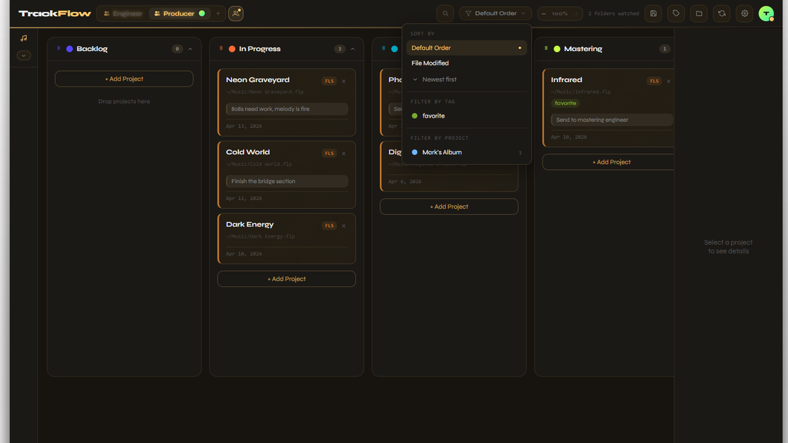
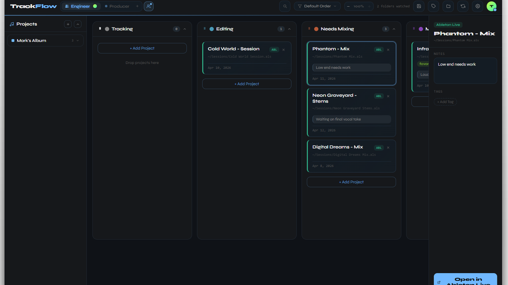
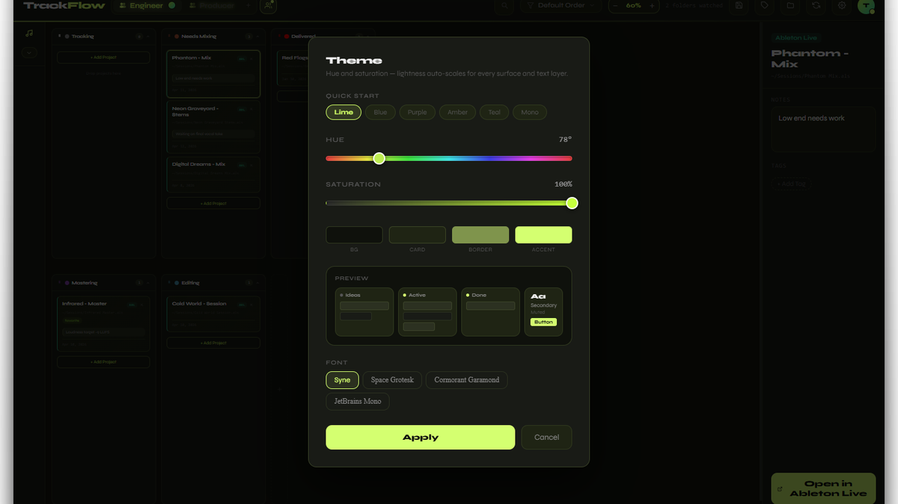
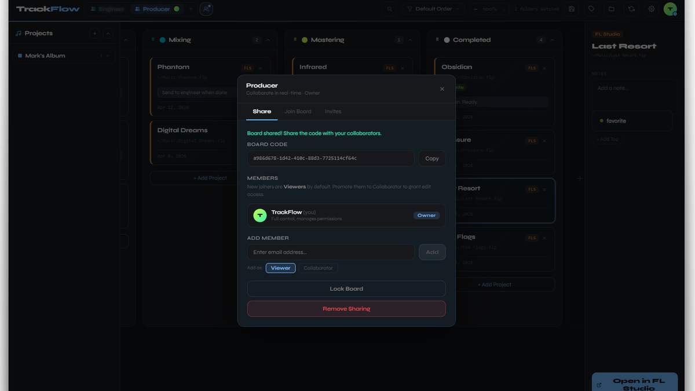

# TrackFlow

A native Windows desktop app for music producers and engineers to organize their DAW projects. Stop digging through folders — TrackFlow scans your drive, finds every FL Studio, Ableton, and Pro Tools project, and puts them on a visual kanban board you can actually work with.

---



<p align="center">
  
  
</p>

<p align="center">
  
</p>

---

## What it does

- **Auto-scans your project folders** — finds `.flp`, `.als`, and `.ptx` files automatically
- **Kanban board** — two workflow modes (Producer / Engineer), drag cards between columns, reorder rows and columns
- **One-click open** — open any project directly in its DAW from inside TrackFlow
- **Custom tags & notes** — tag projects by status, genre, client, or anything else
- **Project library** — organize songs into named projects in the sidebar, click a song to jump straight to its card on the board
- **Themes** — built-in presets plus full custom theme editor (colors, fonts, borders)
- **Keyboard shortcuts** — power-user hotkeys for duplicate, delete, rename, and more
- **Real-time collaboration** — share boards with producers and engineers, role-based access, cloud backup

---

## Download

**[Download for Windows — $10](https://github.com/gnznaki/TrackFlowRelease/releases/latest)**

Windows 10 / 11 · 64-bit · One-time purchase · No subscription

### Installation

1. Download the `.exe` installer from the link above
2. Run the installer
3. Windows SmartScreen will show a security warning — click **"More info"** then **"Run anyway"**
4. TrackFlow installs and launches automatically

> **Why does Windows warn me?**  
> TrackFlow is not yet signed with a paid code-signing certificate. This triggers a SmartScreen warning on every install — it does *not* mean the app is unsafe. Every release is scanned with VirusTotal before publishing. [The v2.0.0 scan](https://www.virustotal.com/gui/file/0f66bdabe0975a235539f9fee63dcb036d129c76ce551f14d48d84682eb0c636/detection) shows **68/71 engines clean** — the 3 that flag it are heuristic/ML-only detections with no malware signature match, a known false positive pattern for unsigned Rust apps. Source code is fully open on GitHub.

---

## Recent Updates

### v2.0.0
- Paid release — $10 one-time purchase via embedded Stripe checkout (no browser redirect)
- Purchase gate: prompts unpaid users to buy immediately after sign-in
- Stripe webhook auto-unlocks account on payment — no manual step required
- Resizable detail panel — drag the left edge to set your preferred width
- Version bump and full app polish pass

### v1.2.0
- Real-time collaboration system — share boards, invite by email, role-based access (editor / viewer)
- Supabase auth — sign in with email/password, profile avatars, display names
- Custom theme editor — full control over background, card, border, accent, and font
- Redesigned auth screen with premium feel
- Fixed cross-row card drag reliability
- Fixed column scroll reset on drag (two root causes: RowDropZone scope and dnd-kit focus attributes)
- Replaced dnd-kit autoScroll with custom RAF-based scroll for card drags
- Song click in project sidebar now reliably scrolls to the card on the board (fixed race condition with page transitions)
- Removed auto-updater (manual updates via GitHub releases while the feature is stabilized)
- Discord crash reporting baked in — errors are automatically reported
- Contact Us form added to Settings for bug reports, feature requests, and questions

---

## Development

```bash
# Prerequisites: Node.js, Rust, Tauri CLI

# Install dependencies
npm install

# Start frontend only (no Tauri shell, runs at localhost:1420)
npm run dev

# Start full desktop app (Rust + React)
npm run tauri dev

# Build frontend
npm run build

# Build installer
npm run tauri build
```

No lint or test commands are configured.

### Tech stack

| Layer | Stack |
|-------|-------|
| Frontend | React 18, Vite, inline styles |
| Desktop shell | Tauri 2 (Rust) |
| Auth / DB | Supabase (Postgres + Realtime) |
| Drag and drop | @atlaskit/pragmatic-drag-and-drop |
| Payments | Stripe (embedded checkout) |

### State persistence

App state is saved to `%APPDATA%\com.trackflow.app\trackflow-state.json` via the Rust backend. Auto-saves 800ms after any change.

### Adding a Rust command

1. Add `#[tauri::command]` function to `src-tauri/src/main.rs`
2. Register it in `.invoke_handler(tauri::generate_handler![..., your_command])`
3. Call it from JS: `await invoke("your_command", { arg: value })`

---

## FAQ

**How much does TrackFlow cost?**  
$10 one-time purchase. No subscription, no recurring charges. Includes all features — unlimited boards, DAW scanning, tags, notes, themes, and real-time collaboration.

**Why does Windows show a security warning when I install it?**  
TrackFlow isn't signed with a paid certificate yet. Windows SmartScreen flags any app without a certificate authority reputation. Click "More info" → "Run anyway".

The v1.2.1 VirusTotal scan shows [68/71 engines clean](https://www.virustotal.com/gui/file/0f66bdabe0975a235539f9fee63dcb036d129c76ce551f14d48d84682eb0c636/detection). The 3 that flag it are heuristic/ML-only detections (Sophos "Generic ML PUA", SecureAge, Arctic Wolf) — none match a known malware signature. This is a documented false positive pattern for newly compiled, unsigned Rust binaries. Every major engine — Windows Defender, Kaspersky, ESET, Bitdefender, Avast, Norton, Malwarebytes — reports clean.

**What DAWs are supported?**  
FL Studio (`.flp`), Ableton Live (`.als`), Pro Tools (`.ptx`/`.ptf`), and Reaper (`.rpp`). Logic Pro and Mac support are in development.

**Where is my data stored?**  
Locally on your machine at `%APPDATA%\com.trackflow.app\`. Nothing is sent to a server unless you sign in and use cloud features. Automatic backups are created before any major operation.

**Does it work on Mac or Linux?**  
Not yet. TrackFlow is Windows-only for now. Mac and Linux builds are on the roadmap once the Windows version is stable.

**Something broke — how do I report it?**  
Use the **Contact Us** button in Settings (⚙) inside the app, or open an issue on [GitHub](https://github.com/gnznaki/TrackFlowRelease/issues). Crash errors are automatically reported so we often already know.
